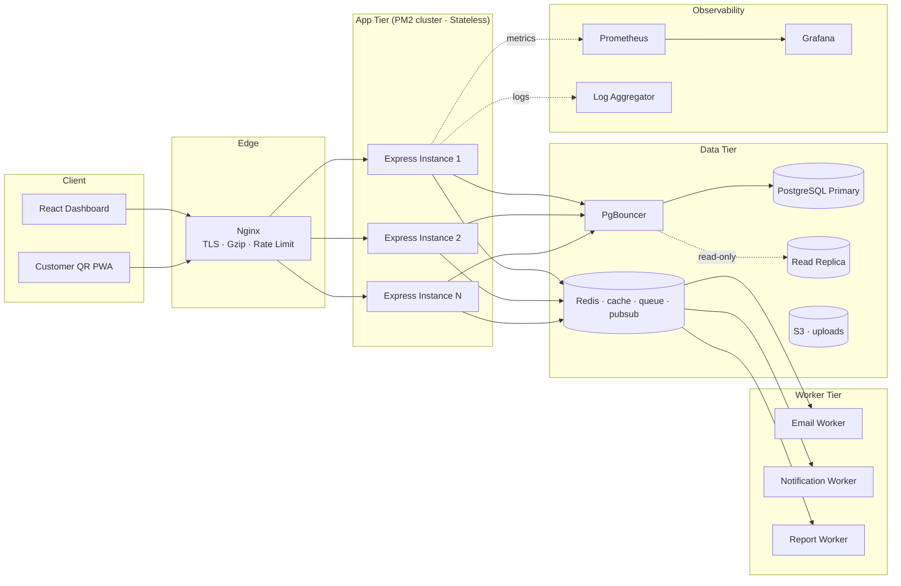

# Vuedine API

Backend API for the Vuedine restaurant POS platform.

> **Status:** Phase 0 — project blueprint. Express, Prisma, and runtime code land in Phase 1+.
> Implementation roadmap: see [`../BACKEND_PHASES.md`](../BACKEND_PHASES.md).

---

## Stack

| Layer                | Choice                                            |
| -------------------- | ------------------------------------------------- |
| Runtime              | Node.js 20 LTS                                    |
| Framework            | Express 4                                         |
| Database             | PostgreSQL 16                                     |
| Cache / RL / Pub-Sub | Redis 7                                           |
| ORM                  | Prisma 5 ([decision](docs/decisions/0001-orm.md)) |
| Auth                 | JWT access + refresh-token rotation               |
| Queue                | BullMQ                                            |
| Containerization     | Docker + Docker Compose                           |
| Process Manager      | PM2 (cluster mode)                                |
| Reverse Proxy        | Nginx                                             |
| Observability        | Winston + Prometheus + Grafana                    |
| Testing              | Jest + Supertest                                  |
| Docs                 | OpenAPI 3.0 + Swagger UI                          |
| CI/CD                | GitHub Actions                                    |

---

## System Architecture



---

## Folder Layout

Feature-based, not layer-based. A folder per feature contains controller + service + repository + routes + validators + tests.

```
api/
├─ src/
│  ├─ config/                env loader, app config, logger bootstrap
│  ├─ db/                    Prisma + Redis singletons
│  ├─ modules/               feature folders (auth, items, orders, ...)
│  ├─ middleware/            shared middleware (auth, rbac, validate, ...)
│  ├─ queues/                BullMQ queues + workers
│  ├─ realtime/              socket.io gateway, pub/sub
│  ├─ utils/                 AppError, asyncHandler, envelope, ...
│  ├─ docs/                  OpenAPI / swagger-jsdoc config
│  ├─ app.js                 Express app construction
│  └─ server.js              HTTP listener + graceful shutdown
├─ prisma/                   schema + migrations + seed
├─ tests/                    unit, integration, fixtures, helpers
├─ docker/                   Dockerfile + Nginx + Postgres init + Prometheus + Grafana
├─ scripts/                  ops scripts (migrate, smoke-test, backup, ...)
├─ docs/
│  ├─ decisions/             architecture decision records (ADRs)
│  ├─ runbooks/              incident response playbooks
│  └─ openapi.json           generated, committed for visibility
└─ .github/workflows/        CI/CD
```

---

## Environment Tiers

| Tier            | Purpose         | DB                             | Redis                          | Workloads                         |
| --------------- | --------------- | ------------------------------ | ------------------------------ | --------------------------------- |
| **development** | Local dev       | Docker postgres                | Docker redis                   | Single PM2 instance, hot reload   |
| **staging**     | Pre-prod mirror | Managed RDS (small)            | Managed Redis (small)          | Cluster of 2, mirrors prod config |
| **production**  | Live tenants    | Managed RDS Multi-AZ + replica | Managed Redis with persistence | PM2 cluster, autoscaling group    |

Each tier has its own `.env.<tier>` stored in Vault / 1Password. Only `.env.example` lives in the repo.

---

## Branching Strategy

| Branch                 | Purpose                                                                         | Protection                                     |
| ---------------------- | ------------------------------------------------------------------------------- | ---------------------------------------------- |
| `main`                 | Production-ready code. Tagged releases ship from here.                          | Required PR review, CI green, no direct pushes |
| `develop`              | Integration branch. Auto-deploys to staging on push.                            | Required PR review, CI green                   |
| `feature/<short-name>` | New work. PR'd into `develop`.                                                  | Squash-merge                                   |
| `fix/<short-name>`     | Bug fixes. Same flow as features.                                               | Squash-merge                                   |
| `hotfix/<short-name>`  | Critical prod fix. Branched from `main`, merged into both `main` and `develop`. | Fast-track review                              |

**Conventional Commits** for messages. **SemVer** for tags (`v0.2.1`).

Production deploys are triggered by `workflow_dispatch` on `main`, gated by manual approval (Phase 12).

---

## Environment Variables

Copy `.env.example` to `.env` and fill in. Every variable is validated on startup (Phase 1) — a missing or malformed value crashes the container with a clear message instead of failing silently.

**Never commit `.env`, `.env.local`, `.env.production`** — only `.env.example`.

---

## Quick Start (Phase 0 — placeholder)

```bash
# Phase 0: nothing to run yet — folder skeleton only.
# Phase 1 will add:
cp .env.example .env
npm install
npm run dev
# → http://localhost:4000/health
```

---

## Documentation

- [`../BACKEND_PHASES.md`](../BACKEND_PHASES.md) — full implementation roadmap (15 phases)
- [`docs/decisions/`](docs/decisions/) — architecture decision records
- [`docs/runbooks/`](docs/runbooks/) — incident response playbooks (Phase 14)
- `/docs` (Swagger UI, served by the API in Phase 13)

---

## License

Proprietary — © Vuedine.
